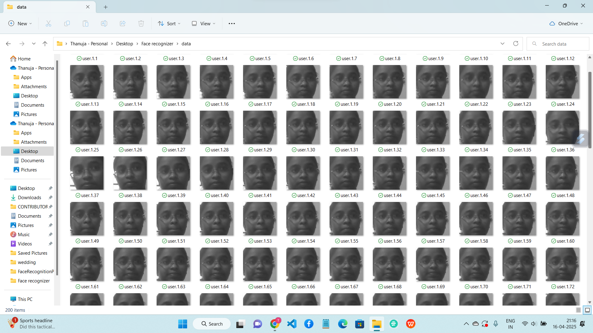

# ML-AI-Projects

# 👤 Face Recognition System

Welcome to my Face Recognition System project!  
This project is focused on building a real-time face recognition application using Python, OpenCV, and machine learning techniques. I’m currently working on it and have completed up to **Part 3: Face Detection/Recognition**. Stay tuned for updates!

---

## ✅ Project Status

- [x] Part 1: Generate dataset  
- [x] Part 2: Train the classifier and save it  
- [x] Part 3: Face detection/recognition  
- [ ] Part 4: Converting the project into GUI  
- [ ] Part 5: Connecting project to the database  
- [ ] Part 6 (Extra): GUI Face Recognition system using Tkinter Canvas  
- [ ] Part 7: Converting the project into a setup (Application) file  

---

## 🎯 What Will You Learn?

- **Part 1:** How to generate a dataset using OpenCV by capturing images through a webcam  
- **Part 2:** How to train a face recognition model and save the trained classifier  
- **Part 3:** Detect and recognize faces in real-time using webcam feed  
- **Part 4:** Design a simple GUI to run the recognition system  
- **Part 5:** Connect recognized faces to a database (e.g., SQLite)  
- **Part 6 (Extra):** Use Tkinter Canvas to display face info and GUI controls  
- **Part 7:** Package the entire project into a standalone application (.exe)

---

## 🖼️ Screenshots & Videos

### 📸 Dataset Generation

### 🧠 Model Training

### 🧍 Face Detection & Recognition

## 🔧 Tech Stack

- Python
- OpenCV
- NumPy
- Tkinter (for GUI)
- SQLite (for future DB connection)
- py2exe / cx_Freeze (for application packaging)

---

## 🛠️ To Do

- [ ] Build GUI with Start/Stop controls  
- [ ] Connect recognized users to a database  
- [ ] Improve face matching accuracy with deep learning  
- [ ] Add attendance system as a future feature

---

## 📌 Note

I'm actively working on this project and will update the repo with new features. Contributions and feedback are always welcome!

---

